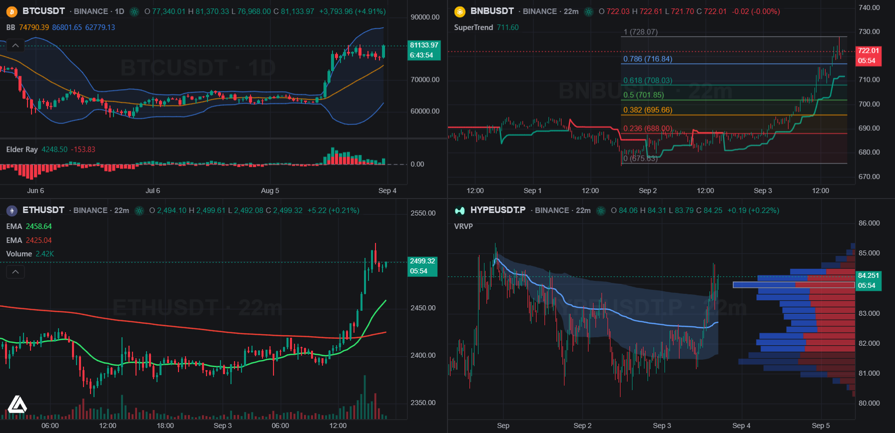

<!-- markdownlint-disable no-inline-html first-line-h1 -->

<div align="center">

  

  <p><strong>Fast, extensible financial charts for the web.</strong><br>
  Headless core · native WebGL2 renderer · batteries-included workspace · plugin SDK</p>

  [![npm version][npm-version-img]][npm-link]
  [![Downloads][npm-downloads-img]][npm-link]
  [![License][license-img]][license-link]

  <p>
    <a href="https://luxalgo.com/vela">Homepage</a> ·
    <a href="#quick-start">Quick start</a> ·
    <a href="docs/index.md">Documentation</a> ·
    <a href="#extending-plugin-sdk">Plugin SDK</a> ·
    <a href="CHANGELOG.md">Changelog</a> ·
    <a href="#license-and-attribution">License</a>
  </p>

</div>

<!-- markdownlint-enable no-inline-html -->

Vela™ renders interactive financial charts with its own native renderer (WebGL2, with a
canvas2d fallback) and keeps the chart itself headless: drive it entirely from code, or
drop in the workspace for a complete chart app in one call. Every layer (data providers,
scripting engines, renderers) plugs in behind a public port and can be swapped without
touching the rest.

## What's in the box

<p align="center">
  
</p>

- **`@luxalgo/vela`**: the headless chart. Data model, engines, drawings, providers,
  native renderer.
- **`@luxalgo/vela/workspace`**: the full chart app. One chart or a grid of them under
  one shared topbar (symbol / timeframe / style / indicators), status line, symbol
  watermark, bottom bar (ranges, clock, timezone), object tree, keyboard-first UX
  (type a letter for symbol search, a digit for timeframe entry, `?` for the shortcuts
  panel), named cells, sync groups, and one persisted state document.
- **`@luxalgo/vela/ui`**: the component kit the app is built on. Design tokens, overlay
  chrome ([Zag.js](https://zagjs.com) menu/dialog/drawer/tooltip), form primitives, and
  the `KeymapManager`.
- **`@luxalgo/vela/plugin`**: the extension SDK. Chart types, renderer layers, native
  indicators.
- **`@luxalgo/vela/providers/*`**: data providers (Binance, Coinbase, Hyperliquid),
  ready to register. Or supply your own bars and stay fully offline.

## Installing

```bash
npm install @luxalgo/vela
```

## Quick start

The fastest path is the workspace, a complete chart app in one call:

```ts
import { VelaWorkspace } from '@luxalgo/vela/workspace';
import { BinanceProvider } from '@luxalgo/vela/providers/binance';

const chart = new VelaWorkspace('#chart', {
    layout: false, // one chart; '2h' | '4' | '8' | … for a multi-chart grid
    symbol: 'BTCUSDT',
    timeframe: '60',
    live: true,
    theme: 'dark',
    providers: { binance: () => new BinanceProvider() },
    persist: true, // restore market, style, timezone, drawings and indicators from localStorage
});
```

Prefer full control? Use the headless core directly:

```ts
import { Vela } from '@luxalgo/vela';
import { BinanceProvider } from '@luxalgo/vela/providers/binance';

const chart = new Vela('#chart', { symbol: 'binance:BTCUSDT', timeframe: '60', live: true });
chart.data.registerProvider('binance', new BinanceProvider());
await chart.ready();
```

No provider, no network? Pass your own bars via the `data` option. See the
[quickstart](docs/user/quickstart.md).

### Browser bundle

The package also ships self-contained browser builds for script-tag usage:
`dist/vela.global.js` (readable, development) and `dist/vela.global.min.js` (minified,
production). Either file attaches the library's public API, including the bundled
providers, to `window.Vela`.

## Indicators

Vela™ ships **70+** built-in studies — moving averages, bands and channels, momentum
oscillators, trend and volatility measures, volume studies, and price-anchored
overlays such as VWAP, SuperTrend, and Pivot Points. They compute from the chart's
own bars (no scripting engine), and each one gets a legend row, a settings dialog,
and persistence across reloads. Volume and the visible-range volume profile sit
alongside them.

Custom scripts still run through pluggable engines. Vela™ **ships none**: install the
addon for the language you want, or write one against the public `ScriptingEngine` port.
Pine Script lives in [`@luxalgo/vela-pinets`](https://github.com/LuxAlgo/Vela-pinets)
(`npm i @luxalgo/vela-pinets pinets`), which is **AGPL-3.0** because the PineTS runtime it
executes is. Vela™ itself stays Apache-2.0 and carries no Pine code:

```ts
import { PineEngine } from '@luxalgo/vela-pinets';

chart.registerEngine('pine', new PineEngine());
chart.addIndicator(`//@version=6
indicator("EMA 20", overlay=true)
plot(ta.ema(close, 20), color=color.orange, linewidth=2)`);
```

Host tooling can execute-and-inject safely with `chart.runIndicator(source)` (structured
errors, no dead legend rows) and read a running script's state, including its **return
value**, via `handle.context()` (read-only snapshots, worker-safe). See the
[API reference](docs/user/api-reference.md#reading-a-scripts-execution-context), and
[Scripting engines](docs/user/scripting-engines.md) for the addon and for writing your own.

The workspace takes an **indicator manifest**: inline JSON, a URL returning it, or an
async loader (`() => Promise<manifest>`):

```ts
new VelaWorkspace('#chart', {
    // …
    engines: { pine: () => new PineEngine() },
    indicators: '/indicators.json', // or an inline [{ name, script | url, language?, enabled? }]
});
```

## Extending (plugin SDK)

Custom chart types and canvas layers register through the public SDK, no fork needed:

```ts
import { registerChartType, registerRendererLayer } from '@luxalgo/vela/plugin';

// A new price style: bar transform + optional per-bar data engine + ticker modifier.
registerChartType({
    id: 'renko-like',
    label: 'Renko-like',
    barTransform: { full: (bars) => transformAll(bars), next: (bar) => transformOne(bar) },
});

// A custom canvas layer, painted every frame with the chart (its id = its data channel).
registerRendererLayer({
    id: 'renko-like',
    placement: 'above-data',
    create: () => ({ mount(canvas) {/* keep it */}, render({ bars, data, coords, scale, bounds }) {/* paint */} }),
});
```

A registered chart type automatically appears in the workspace's style dropdown, and a
chart type's `dataEngine` pushes to its layer's channel with zero extra wiring. See
[docs/contributing/plugin-sdk.md](docs/contributing/plugin-sdk.md).

## Documentation

Full documentation lives in [docs/](docs/index.md): user guides ([quickstart](docs/user/quickstart.md),
[the workspace](docs/user/workspace.md), [options](docs/user/options.md), [API reference](docs/user/api-reference.md)),
[architecture](docs/architecture/overview.md), and [contributing](docs/contributing/setup.md) guides
including the [plugin SDK](docs/contributing/plugin-sdk.md).

## Development

```bash
npm install
npm run playground   # vite playground on http://localhost:5190
npm test             # vitest
npm run build        # tsup → dist/
```

## License and attribution

Vela™ is licensed under the **Apache License, Version 2.0** (see [LICENSE](LICENSE)).
The [NOTICE](NOTICE) file adds an **attribution requirement**, and redistributions must
include it per Apache-2.0 §4(d):

- Every chart renders a small **Vela™ attribution watermark** — the project logomark,
  linking to the [project page][homepage] — enabled by default. You may restyle or
  reposition it to fit your design.
- You may turn the watermark off (`chart.renderer.set('attribution', false)`) **only if**
  an equivalent visible attribution is shown elsewhere on the same page or screen, where
  your users can see it: the name "Vela™" linking to the project page.
- Removing, hiding, or obscuring the attribution without providing that equivalent
  notice is not permitted.

This is the same licensing model used by other popular charting libraries, and we're
grateful when the watermark stays in a visible spot.

No scripting engine ships with this package; the Pine Script addon
(`@luxalgo/vela-pinets`) is AGPL-3.0 and licensed separately (see *Indicators*).

[homepage]: https://luxalgo.com/vela

[npm-version-img]: https://img.shields.io/npm/v/%40luxalgo%2Fvela.svg
[npm-downloads-img]: https://img.shields.io/npm/dm/%40luxalgo%2Fvela.svg
[npm-link]: https://www.npmjs.com/package/@luxalgo/vela

[license-img]: https://img.shields.io/badge/license-Apache--2.0-blue.svg
[license-link]: LICENSE
