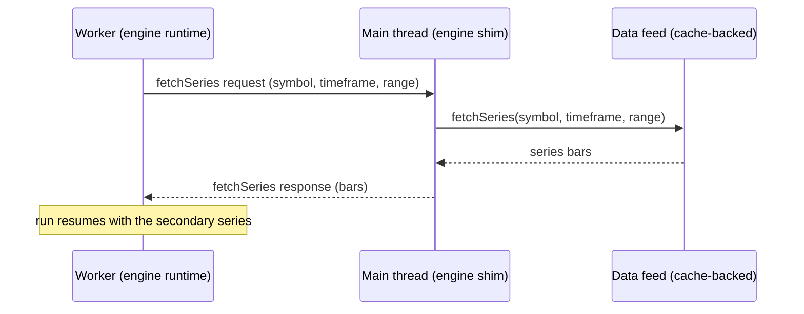

# Adding a Scripting Engine

Scripting engines are one of Vela™'s three swappable **layers** (alongside [data providers](./adding-a-data-provider.md) and [renderers](./adding-a-renderer.md)). This page explains what an engine is, the small surface you implement, and the rules the core uses to drive it. It is conceptual — for the exact field shapes, read the `ScriptingEngine` port (exported from the root entry and from `@luxalgo/vela/plugin`).

Everything an engine builds against ships on the **`@luxalgo/vela/plugin`** subpath — the port types, the model vocabulary, the id helper, the semantic palette — which is why **no engine lives in this repo**: Vela™ bundles none, and every one is a separate package or host module. See [*Building an engine as its own package*](#building-an-engine-as-its-own-package) below; to *consume* an existing engine rather than write one, see [Scripting engines](../user/scripting-engines.md).

> The engine port is stable in shape but still evolving.

## What an engine is

An engine turns **source in some language** into a **neutral drawable model** — the same indicator model every renderer knows how to paint. **Vela™ bundles none**: every engine is a separate package or host module implementing this port. `@luxalgo/vela-pinets` (Pine Script, in-process and Web-Worker forms) is the reference implementation; `playground/demo-engine.ts` in this repo is a ~300-line one you can read in a sitting.

The core never learns the language, the runtime, or how the source was evaluated. It hands the engine source text plus market context and gets back a stream of neutral models. That opacity is the whole point: it is what lets one chart run one language today and another tomorrow without touching the core.

The core owns everything downstream of the model — pane routing (overlay vs study) and mounting on the renderer. The engine emits an **unrouted** model and stays out of presentation entirely. One thing the engine *does* own is the ids **inside** that model: every series and drawing carries an id the engine minted, and those ids are a contract — see [*Stable ids*](#stable-ids-the-identity-contract) below.

## The surface you implement

An engine is a small object with four things:

- **A unique language id** — e.g. `'pine'`. This is the registry key the core selects on.
- **An honest capabilities object** — booleans the core trusts without re-checking:
  - `streaming` — can keep a persistent incremental context alive for live ticks (vs a full re-run each time).
  - `visibleRange` — understands viewport-dependent execution (scripts that read "the left/right visible bar time").
  - `inputs` — exposes an inputs schema that drives the renderer's settings dialog.
  - `props` (optional) — exposes a declaration-props schema (see below) and honors prop overrides on `execute`/`update`.
- **`prepare`** — a cheap, async parse.
- **`execute`** — the run.

Capability honesty matters. The core routes on these flags and does not second-guess them. A backend that advertises `streaming: true` but cannot actually stream produces silent wrong output, not an error.

### prepare — a cheap parse, no market data

`prepare(source, instanceId)` parses the script and resolves to a **prepared script** descriptor. It is **async** — it returns a Promise the core awaits — so a parser can be loaded or run off the hot path. It touches **no market data** — no bars, no fetches, nothing that hits the network. It only inspects the source.

It resolves to:

- **An inputs schema** — the typed inputs the script exposes (the renderer turns this into a settings UI).
- **A declaration-props schema (optional)** — the *mutable arguments of the declaration call itself* (a strategy's `initial_capital`, an indicator's `precision`, …), in the same schema shape as inputs. The renderer shows them on a "Properties" settings tab. Make each entry's `defval` the **effective** default: the value the script declares, else your engine's configured default, else the language's own — the dialog opens on it and "Reset defaults" restores it.
- **Declaration metadata** — what the script declares about itself (title, overlay vs study intent, and so on).
- **A static `reactsToViewport` guess** — whether the source references a viewport built-in. This is a *static guess*, detected by scanning the source; it can be refined after the first real run.
- **An opaque engine-internal token** — whatever the engine wants to read back at execute time (a parsed AST, a compiled function, a handle). The core treats it as a black box and never inspects it.

Because `prepare` is cheap and data-free, the core can call it eagerly to build settings UI before any execution happens.

### execute — synchronous handle, async run

Where `prepare` is async, `execute(request, handlers)` is the opposite: it returns an **execution session synchronously**, even though the actual run is asynchronous. The session is a handle the core holds immediately; results arrive later through the handlers. This split is the single biggest source of confusion for new authors, so keep it crisp: the call returns a control surface right away, and the work happens behind it.

The request carries everything the run needs: the prepared script, market context (symbol, timeframe, optional symbol info), the bar snapshot, resolved input values, an optional visible range, the `fetchSeries` gateway, a `mode`, and where the chart's history load stands (`historyState` — see [*History backfill*](#history-backfill-partial-bars-engine-owned-run-policy)).

Two request fields deserve care:

- **`market.symbolInfo` arrives asynchronously.** The feed fetches it in the background, so the first run may see it absent — or a synthesized fallback — and a later run the real values. Tolerate both; never treat its absence as an error.
- **`market.chartStyle` is metadata, not a request to transform.** On a bar-transforming price style (e.g. Heikin Ashi) the bars you receive are *already* the transformed view. What the engine does with the flag: encode it into the chart's ticker identity (the extended ticker, `"SYM;heikinashi"`), so a security-style secondary fetch can distinguish "the chart's derived series" from raw data — the standard ticker opts back into raw. Engines with no such feature may ignore it.

## The data inversion (the heart of it)

This is the rule that surprises most engine authors: **engines never fetch the chart's own candles.**

The core owns the canonical bar array and is the sole loader and streamer of primary data. It passes those bars **into** `execute` as a snapshot, plus a live accessor the engine reads on each re-run or tick. The engine is *fed* its data; it does not go get it.

Secondary series are different but still inverted. When a script needs another series — a higher or lower timeframe, or a different symbol (Pine's `request.security`) — it does not open its own connection. It calls the **`fetchSeries` gateway** the core supplies, keyed by `(symbol, timeframe)`. That gateway is cache-backed by the chart's data feed, so secondary series get real, correctly-resolved data. There is **no aggregation**: timeframes are kept separate, never derived from the primary bars by rolling them up. If a script asks for an hourly series, the gateway fetches hourly data.

If no gateway is supplied, secondary fetches degrade to empty rather than failing — the primary series still runs.

Why it matters: causality. Scripts are stateful and run over **all** bars, never just the visible window. Centralizing data ownership in the core keeps one consistent, correctly-ordered, deduped bar history feeding every engine and renderer. The viewport changes *what* a viewport-aware script computes — it never scopes *which* bars execute.

## Stable ids: the identity contract

Every series and drawing in the model carries an **id the engine minted**, and the core
treats those ids as identity across time: a re-run or live tick does not remount the
indicator — the core builds a **value patch keyed by series id** and the renderer updates
the mounted series in place. That only works if the same logical series gets the **same
id on every run**.

So ids must be *reproducible*, never random and never dependent on run order alone. Mint
them with the helper the core itself relies on:

```ts
import { stableSeriesId } from '@luxalgo/vela/plugin';

const id = stableSeriesId({ instanceId, kind: 'line', title: 'EMA 20', ordinal: 0 });
```

`instanceId` is the id the core handed to `prepare` — it namespaces everything to the
indicator instance. `ordinal` disambiguates same-titled outputs of the same kind (first
untitled plot, second untitled plot…): derive it from a per-run counter that resets at
the start of every run, so run N and run N+1 assign the same ordinals in the same order.

An engine that invents its own id scheme still *appears* to work — first mounts are
fine — and then bleeds: value patches miss their target and every tick degrades into
remount churn, and anything a host keys by series id stops lining up between runs.
Use the helper.

The **indicator id** (`model.id`) is different: set it to the `instanceId` you were
given. Instance identity belongs to the core; intra-model identity belongs to you.

## The session: the control surface the core drives

The execution session is how the core drives a running script. It exposes four levers:

- **`stop()`** — tear down; stops any streaming or incremental re-execution.
- **`update(inputs, props?)`** — re-run (or re-stream) with merged input overrides. An input can restructure output, so this can be a structural change. When your engine advertises `props`, the second argument (when present) carries the merged declaration-prop overrides — apply both and replay; an engine without props support can ignore it.
- **`setVisibleRange(range)`** — push a new viewport window. Re-runs viewport-dependent scripts; a no-op for everything else.
- **`notifyBars(reason?)`** — signal that the core's bars changed. **No reason** = a live tick (forming candle or a new bar). **`'backfill'`** = older history chunks were just prepended and the load is still in progress. **`'complete'`** = the history load finished (fires exactly once per load). What to *do* about each reason is the engine's decision, not the core's — see [*History backfill*](#history-backfill-partial-bars-engine-owned-run-policy).
- **`getContext(select?)`** *(optional)* — resolve a read-only `EngineContextSnapshot` of the run (phase, bar index, plots, variables, strategy state, trades, warnings). Implement it if your language has host-inspectable state; return **copies only** (never live references), keep it async (the bundled worker engine answers over `postMessage`), and honor `select` so callers can limit extraction. Skipping it is fine — `handle.context()` then resolves `null`, and the core's `script:run` still reports what the model carries (title, plots, cause).

  Two obligations govern what you put in it, because both surface directly to host code:

  - **`variables` is keyed by the names WRITTEN in the source.** If your transpiler mangles or scopes names internally (`glb1_posSize` for a source `posSize`), un-mangle them here and drop the buckets. A host must never learn your scoping scheme, and values are the ones at the last computed bar — not per-bar series buffers.
  - **`strategy` and `trades` are neutral.** A language with simulated order execution translates its own vocabulary into `StrategyState` (`position`, `equity`, `openPnl`, `netPnl`, `wins`/`losses`, drawdown/runup) and `StrategyTrade` (round trips: `entry`, optional `exit`, `side`, `qty`, and — when the engine keeps a per-trade ledger — the optional `pnl`, `commission`, `maxDrawdown`, `maxRunup`). That translation is what lets one dashboard read strategies written in any language. Fill `strategy` only for scripts that actually declare a strategy — its presence is how the core tags a run `kind: 'strategy'`. Keep `trades` behind `select`: a deep backtest's ledger is large, and the core never pulls it for an ordinary run.

Results flow back the other way, through the **handlers** event sink:

- **`onModel(model)`** — the produced neutral model. This fires on the **first run AND on every re-run / live tick**. It is not a one-shot; treat it as a stream of model snapshots.
- **`onAlert` / `onWarning` / `onError`** — optional diagnostics and failures.
- **`onDone`** — a *static* run finished. It is **not** fired for an open live stream (a live stream has no "done").

Think of it as: the core pulls the session's levers, the engine pushes models and events back. New authors most often trip on the session **lifecycle** — forgetting that `onModel` repeats, or holding resources past `stop()`. Wire `stop()` to release everything, and make every `onModel` emission a complete, self-consistent model.

## Static vs live modes

The request's `mode` is `'static'` or `'live'`, and it is a **capability-gated routing decision** the core makes — not something the engine picks.

- **Static** — runs on demand and re-runs when the session is poked (`update`, `setVisibleRange`, `notifyBars`). Each poke is a fresh run.
- **Live** — keeps a persistent streaming context that emits per tick. The core only requests live mode when the chart is live, the script is not viewport-dependent, **and** the engine declares `streaming: true`. Otherwise it falls back to the static re-run path.

So a non-streaming engine still updates on live data — it just does it by re-running statically on each `notifyBars`, rather than maintaining an incremental context.

## History backfill: partial bars, engine-owned run policy

The chart paints fast by loading history progressively: a small newest window first,
then older chunks streaming in behind the interactive chart. For an engine this means
**the bar snapshot handed to `execute` can be a partial history** — the newest bars
only, with the rest still arriving.

The request says so: **`historyState: 'backfill'`** means the load is still in
progress; `'complete'` (or the field absent — older hosts, direct callers) means the
history is all there. While a backfill is running, every bars notification carries the
`'backfill'` reason — including live ticks that land mid-load — and when the load
finishes, the session receives **exactly one `notifyBars('complete')`**. That single
`'complete'` is guaranteed even when the load ends early (venue genesis reached, or the
load aborted): "complete" means *the core is done changing history*, not *the depth you
asked for exists*.

What to run and when is **the engine's policy**. The Pine engines hold: a
session that starts during a backfill defers its first run, `'backfill'` pokes are
ignored, and the first execution happens on `'complete'` — because scripts are stateful
over **all** bars, so a run over a partial prefix computes values that are simply wrong,
at full-history cost, once per chunk. A language designed for incremental prefixes may
choose the opposite and re-run on every reason to paint progressively. Both are valid;
what is not valid is ignoring `historyState` and treating the initial snapshot as
complete history.

## One runtime, two engines: the transport-agnostic pattern

The Pine addon's in-process and Web Worker engines are not two implementations. They share a **transport-agnostic runtime**: a neutral run function plus a context-to-model mapper. The run function evaluates source over bars; the mapper turns the resulting context into a neutral model. Neither knows whether it lives on the main thread or in a worker.

That shared core is what lets **one implementation power both** an in-process engine and a worker engine.

The worker substrate is **the same port re-expressed over a serializable message protocol**. Concretely:

- **Bars are shipped as data** on each call (structured-clone across the thread boundary), not shared by reference.
- **Handler callbacks become messages** — `onModel`, alerts, warnings, errors, done all arrive as posted messages the main-thread shim re-dispatches to your handlers.
- **A `fetchSeries` call becomes a request/response pair** — the worker cannot reach the data feed, so it asks the main thread, which answers.

### Worker fetchSeries round-trip



From the engine runtime's point of view, calling `fetchSeries` looks identical in both forms — only the transport differs.

## Building an engine as its own package

An engine **does not live in this repo** — the whole authoring surface is public, and the
Pine engines ship as a separate package built exactly this way (`@luxalgo/vela-pinets`,
the reference implementation; its own repo also because of licensing — its runtime
dependency is AGPL while Vela™ is Apache-2.0).

Everything you need comes from **`@luxalgo/vela/plugin`**:

- the **`ScriptingEngine` port types** — the port itself, `PreparedScript`,
  `ExecutionRequest` / `ExecutionHandlers` / `ExecutionSession`, `EngineContextSnapshot`,
  `BarsChangeReason`, and friends;
- the **model vocabulary** — `OHLCV`, `IndicatorModel`, the series / scene / drawing
  specs your `onModel` payloads are made of, plus `InputSchema` for `prepare`;
- **`stableSeriesId`** — the identity contract above (a *value* import, and the reason
  to depend on `@luxalgo/vela/plugin` rather than retyping shapes);
- the **semantic palette** — Vela™'s fixed meaning-colors (`ACCENT`, `BULLISH`, …), so
  your default plot colors match what the rest of the chart means by them.

Ground rules for the package itself:

- **Your language runtime is your dependency, not Vela™'s.** Declare it as your own
  (peer) dependency; Vela™'s core never imports it and never learns it exists.
- **Import Vela™ values from subpaths** (`@luxalgo/vela/plugin`); type-only imports are erased at
  build time and may name any entry. Keep `@luxalgo/vela` itself a peer/external in
  your build — never bundle a second Vela™, which would duplicate the SDK registries.
- **Transport is your concern, not the port's.** If you offer a worker form, the
  inlining/spawning machinery is your build's business; the port sees the same
  `ScriptingEngine` either way.

## Registering and selecting engines

There is **no default engine**. A bare chart shows candles only; running an indicator with no engine throws an explicit, actionable error telling you to register one.

Register engines by **language id**, four ways:

- **Bulk at construction** — pass engines in the dependency object; each is registered under its own `language`.
- **A `registerEngine(language, engine)` call** — register (or replace) one after construction.
- **The widget's `engines` option** — lazy factories, one instance made per chart (re)build: `engines: { pine: () => new PineWorkerEngine() }`. Note these register through `registerEngine` *after* construction, so they do **not** seed `defaultLanguage` (below): with the widget, a non-`'pine'` language needs the `defaultLanguage` option or a per-indicator `language`.
- **The app-level default: `registerDefaultEngine(language, factory)`** (`@luxalgo/vela/plugin`) — every widget and workspace cell built afterwards registers `factory()` on its chart automatically, one instance per chart. A per-instance `engines` option wins for the same language; the bare `Vela` chart never reads this registry. This is the path an enabler-style integration takes (call once, before constructing anything); the `defaultLanguage` caveat above applies to it the same way.

Re-registering a language is **last-wins**, and applies to *future* indicators only — already-running sessions keep their engine.

### How the core picks an engine for an indicator

Selection happens **per indicator**, and the core resolves it in just two steps:

1. The indicator's own `language`, if `addIndicator` was given one.
2. Otherwise the chart's `defaultLanguage`.

The key thing to internalize: **`defaultLanguage` is fixed at construction.** It is not recomputed as you register engines. The core seeds it once when the chart is built — to the first engine you pass in the construction dependency object (falling back to `'pine'` if you pass none) — and it does not change afterward.

That has a real consequence: if you register an engine **only** through `registerEngine` after construction and never set `defaultLanguage`, the default still points at whatever it was seeded to. A no-language `addIndicator` will then resolve to that seeded language — and if nothing is registered under it, you get the actionable error, not silent candles-only behavior.

So, to make a language the default, do one of:

- **Pass that engine in the construction dependency object** so it seeds `defaultLanguage`, or
- **Set `defaultLanguage` explicitly** to a language you have registered, or
- **Name the `language` on each `addIndicator` call** to bypass the default entirely.

Whichever path you choose, if the resolved language has no registered engine, you get the actionable error.

## Gotchas

- **`reactsToViewport` is a static guess.** `prepare` detects viewport built-ins by scanning source. The first real run can prove the guess wrong; an engine may refine the flag in place afterward. Don't treat the prepare-time value as final.
- **`prepare` is async, `execute` is sync.** Await the `prepare` Promise before you build settings UI; expect `execute` to hand back a session immediately and deliver results through handlers.
- **In-process and worker can advertise different capabilities.** They may share a runtime but not their capability flags — route on what each form actually declares. (Both Pine forms declare `streaming: true` today; the worker holds its persistent stream inside the worker and receives live bars as small deltas.)
- **A worker engine is typically spawned from a Blob URL.** The Pine addon inlines its worker at build time and instantiates it from a Blob URL. Under a strict Content-Security-Policy, `worker-src blob:` (or equivalent) must be allowed, or the worker engine will fail to start. If you cannot allow `blob:`, the worker engine accepts a `workerUrl` option pointing at a hosted worker script you serve yourself — use that to satisfy a `worker-src 'self'` (or specific-origin) policy instead. The in-process engine has no such caveat.
- **`onModel` is a stream, not a callback-once.** Build your session so every emission is complete and `stop()` releases everything.
- **`historyState` is the initial state; reasons are transitions.** A session created *after* the history load finished never receives a `'complete'` notification — its request already said `historyState: 'complete'` (or omitted the field, which means the same). Don't build a policy that waits for a `'complete'` that already happened; read the request field first.

## See also

- [Adding a Renderer](./adding-a-renderer.md) — the layer that paints the neutral model.
- [Adding a Data Provider](./adding-a-data-provider.md) — the feed that owns bars and backs `fetchSeries`.
- [Plugin SDK](./plugin-sdk.md) — the rest of the `@luxalgo/vela/plugin` surface (chart types, renderer layers, widget contributions).
