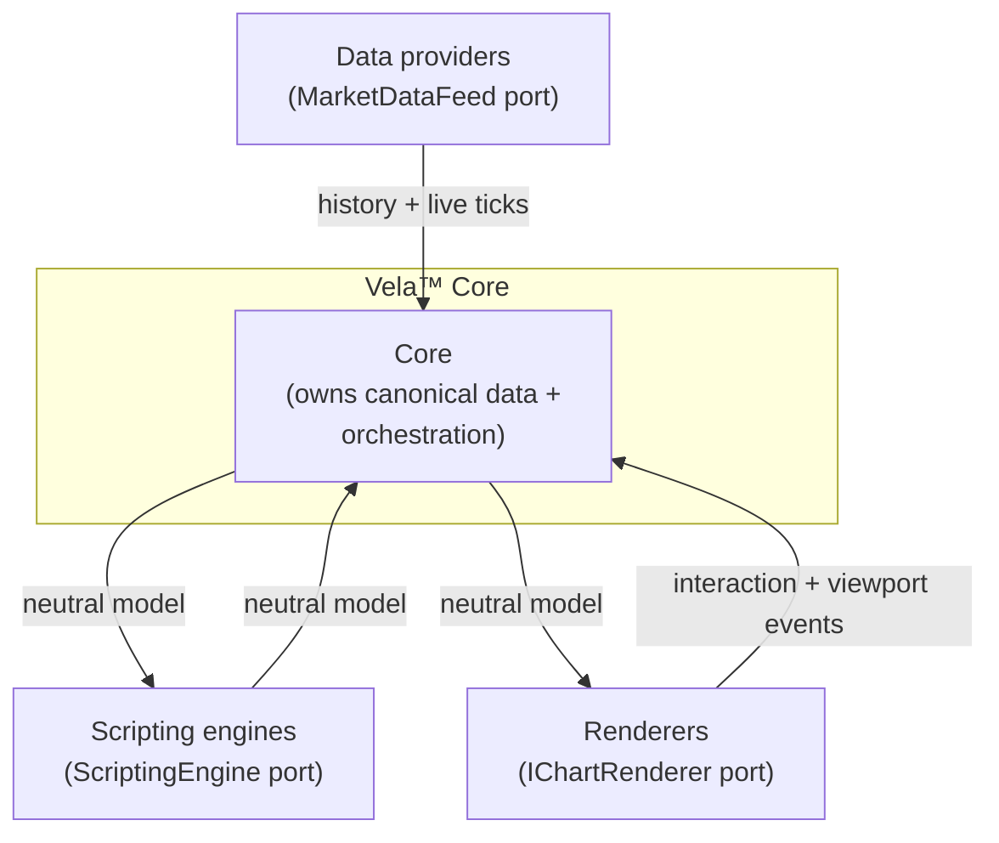

# Vela™

Vela™ is a modern charting library built around a small, robust **core** wrapped by three independently-extensible **layers**: **Data providers** feed market data in, **Scripting engines** execute indicators, and **Renderers** draw the result. The core owns the canonical data and orchestrates everything; each layer plugs in behind a single narrow port, so you can swap any one of them — a different data source, a different scripting language, a different drawing backend — without touching the others or the core.

On top of the core, Vela™ ships two more things: a **shell** (`@luxalgo/vela/workspace` — the batteries-included chart app, one chart or a grid: topbar, pickers, status line, bottom bar, object tree, keyboard-first UX) and a **plugin SDK** (`@luxalgo/vela/plugin` — chart types, renderer layers, native indicators, widget actions) that lets external packages extend both.

## The one mental model

There is exactly one idea to hold onto:

> **The core owns the data and the orchestration. Everything else plugs in behind one of three ports.**

The core holds the canonical bar array, loads and streams primary data, routes indicator output to panes, and stamps content-addressed identities that stay stable across re-runs (so a live tick patches the exact existing series instead of redrawing it). The three layers are the only places it depends on the outside world, and it reaches each one through a single port. The only thing that ever crosses a port is the **neutral model** — bars, series, pane overlays, drawings, inputs, and update patches. No backend-specific type ever crosses. That opacity is precisely what makes each layer swappable.

Every layer is reached through a port, and every layer is swappable. The arrows show what crosses each boundary: data providers feed history and live ticks in; the scripting engine receives bars and returns a neutral indicator model; the renderer receives the model to draw and raises interaction and viewport events back to the core. Whatever crosses is always the neutral model — never a backend-specific type.

## Swappable defaults

Each layer ships with a **bundled default backend** that you can replace. One nuance to know up front: only the **renderer** is *auto-wired* — neither a scripting engine nor a data provider is selected automatically (you register the ones you need).

- **Renderers** — the **native renderer** is the default and only bundled backend (WebGL2, with a canvas2d fallback). The `IChartRenderer` port accepts custom classes.
- **Scripting engines** — **none is bundled.** Vela™ defines the port and ships no engine: install one as an addon (Pine Script: [`@luxalgo/vela-pinets`](user/scripting-engines.md), in-process and Web-Worker forms) or write your own against the port. Nothing is auto-wired either: a bare chart shows candles, drawings and native indicators only, and running a script without a matching engine raises an actionable error.
- **Data providers** — the default feed is a **multi-provider registry** with built-in closed-bar caching, but **no provider is bundled**. Register one with `chart.data.registerProvider(...)` (e.g. the from-scratch Binance provider at `@luxalgo/vela/providers/binance`); registering it fires the chart's parked initial load. Offline `data` needs no provider.

## How these docs are organized

The documentation is grouped by what you are trying to do.

- **User** — get a chart rendering and drive it from your app: [Quickstart](user/quickstart.md), [The workspace](user/workspace.md) (single chart or a multi-chart grid), [Options](user/options.md), [API reference](user/api-reference.md), [Drawing tools](user/drawing-tools.md), [Timeline marks](user/timeline-marks.md), [Renderer features](user/renderer-features.md), [Data providers](user/data-providers.md), [Scripting engines](user/scripting-engines.md), [Examples](user/examples.md), [FAQ](user/faq.md).
- **Architecture** — understand the core, the three layers, the neutral model, and how data flows: [Overview](architecture/overview.md), [Data flow](architecture/data-flow.md), and the [decision records](architecture/adr/README.md).
- **Contributing** — set up the project and extend Vela™: the [plugin SDK](contributing/plugin-sdk.md) (chart types, renderer layers, widget actions — no fork needed), or extend a layer behind its port in-repo: add a [renderer](contributing/adding-a-renderer.md), an [engine](contributing/adding-an-engine.md), a [data provider](contributing/adding-a-data-provider.md), a [drawing tool](contributing/adding-a-drawing-tool.md), or a [UI-kit component](contributing/adding-a-ui-component.md).

## Reading paths

Pick the path that matches your goal.

- **"I want a full chart app in one line"** → [The workspace](user/workspace.md) with `layout: false`
- **"I want a grid of charts with one shared UI"** → [The workspace](user/workspace.md)
- **"I want to render a headless chart fast"** → [User quickstart](user/quickstart.md)
- **"I want to run Pine Script indicators"** → [Scripting engines](user/scripting-engines.md)
- **"I want to draw on the chart"** → [Drawing tools](user/drawing-tools.md)
- **"I want to pin events — dividends, news, releases — to the chart"** → [Timeline marks](user/timeline-marks.md)
- **"I want a custom chart type or overlay"** → [Plugin SDK](contributing/plugin-sdk.md)
- **"I want to grasp the design"** → [Architecture overview](architecture/overview.md)
- **"I want to add a backend"** → choose the port you're extending:
  - a new drawing/output backend → [adding a renderer](contributing/adding-a-renderer.md)
  - a new scripting language/engine → [adding an engine](contributing/adding-an-engine.md)
  - a new market-data source → [adding a data provider](contributing/adding-a-data-provider.md)
  - a new interactive drawing tool → [adding a drawing tool](contributing/adding-a-drawing-tool.md)
- **"I want to contribute code"** → [Contributing setup](contributing/setup.md)
